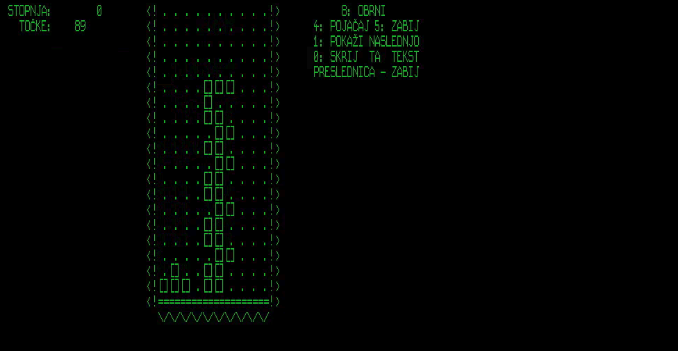

![status.badge] [![language.badge]][language.url] [![standard.badge]][standard.url] [![license.badge]][license.url]

# idp-dev

Welcome to the **idp-dev**, a repository, dedicated to the 
*Iskra Delta Partner* development.

 

We are a group of volunteers, providing tools and tutorials to developers
writing software for the *Iskra Delta Partner* computer.

> The repository is currently under construction, things change. 

# Cloning this repository

The repository **contains submodules**, please use

~~~
git clone https://github.com/tstih/idp-dev.git --recurse-submodules
~~~

You were warned.

# Table of Contents

- [idp-dev](#idp-dev)
- [Cloning this repository](#cloning-this-repository)
- [Table of contents](#table-of-contents)
- [Projects](#projects)
  * [The C runtime](#the-c-runtime)
    + [Software architecture](#software-architecture)
    + [Current Status](#current-status)
    + [Compiling your program](#compiling)
    + [Hello World](#hello-world)
  * [The test framework](#the-test-framework)
  * [Utilities](#utilities)
  * [Games](#games)
    + [TETRIS](#tetris)
- [Building the idp-dev](#building)
  * [Prerequisites](#prerequisites)
  * [Make](#make)
  * [Other make targets](#other-make-targets)
- [Internals](#internals)
- [Creating Disks Manually](#creating-disks-manually)
  * [Create hard drive](#create-hard-drive)
  * [Create floppy drive](#create-floppy-drive)
  * [Add local files to disk](#add-local-files-to-disk)
  * [Remove files from disk](#remove-files-from-disk)
- [The Emulator](#the-emulator)
- [Thank You](#thank-you)
- [The Team](#the-team)

# Projects

## The C runtime

Our initial project was *the C runtime*, consisting of a **C compiler** and a **Standard C library**. We initially adjusted the [SDCC compiler suite](http://sdcc.sourceforge.net/) to generate `.com` files for *Iskra Delta Partner* and wrote the standard library.

Later we realized that the wider retro community, using various *Z80* machines and *CP/M* systems, could benefit from our work, thus we separated it into four projects:

 * [libsdcc-z80](https://github.com/tstih/libsdcc-z80) is a library for bare metal programming
   with *SDCC*. You can use it to write programs from scratch for any *Z80* platform. Navigate to it to find out what it does and how to use it.

 * [libcpm3-z80](https://github.com/tstih/libcpm3-z80) is a platform independent 
   *Standard C library* for *CP/M 3*. If you are interested in how a `.com` program for
   CP/M is created, and what parts of *the Standard library* are immplemented, you'll find 
   the answers to your questions here.

 * **libpartner** provides access directly to *Partner* hardware. It also injects platform
   specific functions into the *libcpm3-z80* enabling extended features, such as managing
   ths system time. This library is now the only *native* part of the `idp-dev` repository. 
   All other libraries are now separate git submodules.

 * [libgpx](https://github.com/tstih/libgpx) is an early version of a platorm independent library 
   for graphics, current targeting Iskra Delta Partner and ZX Spectrum 48K. 

### Software Architecture

Following figure shows interdependencies between the submodules.

 

All libraries and software requires `libsdcc`. Partner programs require `libcpm3-z80`, and 
this library obtains native functions (such as reading and writing the system clock!) from `libpartner`. The `libgpx` is by design a multiplatform 
library and it brings its own graphical drivers ... hence no dependencies to `libpartner`.

### Current Status

| Module                     | Status (complete) |
|----------------------------|-------------------|
| The SDCC auxiliary library | |
| The Standard C library     | |  
| The Partner library        | |
| The Graphics library       | |

The unfinished part of the *Standard C library* is the file system. We threw away
existing implementation, because it is non-optimal and memory hungry. We're writing 
it from scratch.

*The Partner library* currently has everything it needs, but we have ambitious plans
with it so it is 50% done. We're just finishing the `conio.h` support for fast console operations.

And, finally, work on *the Graphics library* has just started. At present we're defining the
portable APIs, and writing tests.

### Compiling

To compile the **idp-dev**, just run `make`.

To compile **your program**, please consult the [libcpm3-z80](https://github.com/tstih/libcpm3-z80) documentation and the `hello` sample.

### Hello World

There is and does what every **Hello World** program in the world should do. 

## The test framework

There are two types of tests in the `test` folder: *automated unit tests* that
automatically verify test results against expected results. And *experiments*,
that test some feature of the operating system, and require the user to check
the results. 

Automated unit tests use the [tiny test framework of Eric Radman](https://eradman.com/posts/tdd-in-c.html), based on [the original MinUnit by John Brewer](http://www.jera.com/techinfo/jtns/jtn002.html). The name of automated unit tests ends in `-test` (i.e. `std-test.com`).

Experiments may create some files, display some data, draw some graphics, etc.
Experiments end with `-xp` i.e. `setup-xp.com`.

At time of writing, forllowing tests are available: 
 * `stdlib/tme-test` Testing the `time.h` functions. **Warning:** sets system time to 1.1.1980.

## Utilities

Small utilities to make your (developers') life easier.

| Utility      | Description                         |
|--------------|-------------------------------------|
| MEMDUMP.COM  | Dump memory contents. |
| PORTDUMP.COM | Read and dump port values. |

## Games

### TETRIS

A text mode version of the game of *Tetris*.

# Building

## Prerequisites

At present the build environment is *Linux* with following tools installed: 
`sdcc`, `cpmtools`, `gcc`, and `sed`. 

 > The *Standard C Library* requires latest version of *SDCC* (**4.1.6**). 
 > You are going to have to [build it from the sources]
 > (http://sdcc.sourceforge.net/). To make things more complicated, 
 > the build process also requires an exact version of the `automake` tools 
 > (**1.16.2**) and will not compile with other versions.
 > Newer versions will also work. 

## Make

Commpile everything with 

`make`

After you are done compiling, create disk image for the emulator with

`make install`

All output will go to the `build` folder. Disk image that you 
can import into the Partner emulator (using **Alt+O**) is called `fddb.img`.

## Other make targets

For comfortable work following targets can also be used. Each
of them creates a `bin` folder, copies the `.com`, `.lib` and `crt0cpm.rel` 
files into it. And then creates a image of the floppy disk called 
`fddb.img` with all the `.com` files to the floppy image, 
   

 * `make install` Create the `bin` folder and standard floppy (with `.com` files).
 * `make ccp` Add `ccp.com` to the floppy. CP/M allows programs to overwrite its'
   command shell called the CCP. When the program ends the CP/M reloads the shell
   and if not present on the disk displays an error (prompts for disk change). 
 * `make boot` Uses a bootable floppy for *std. partner* as a base for creating
   the disk image. 
 * `make bootg` Uses a bootable floppy for *graphical partner* as a base for
   creating the disk image
 * `make dex` Calls `make install` and copies the floppy image to a user
   folder (`~/Dex/`). Use this if you work in *Linux* and need to exchange 
   the image with enother environment (i.e. a *Windows* where the emulator
   is running). *In case you wonder, dex stands for Data EXchange.*

# Internals

While reverse engineering the Partner and writing code, we are keeping 
notes on its internal functioning. While these are not well structured,
they are a rich source of information about inner functioning of
Iskra Delta Partner and the softwares.

 * [Computer and OS start up process](doc/notes/startup-notes.md)
 * [Text (&terminal)](doc/notes/avdc-notes.md)
 * [Graphics](doc/notes/gdp-notes.md)
 * [Hard disk](doc/notes/hdd-notes.md)
 * [Floppy disk](doc/notes/fdd-notes.md)
 * [Serial communication (Z80 SIO)](doc/notes/z80sio-notes.md)
 * [Real time clock](doc/notes/rtclock-notes.md)
 * [Porting software plans](doc/notes/porting-notes.md)

# Creating Disks Manually

Use the `cpmtools` package to create your own disks for the emulator.

http://www.moria.de/~michael/cpmtools/

Disk definitions for Partner floppy and hard drives are in
the the `scripts\diskdefs` file.
 * `idpfdd` for floppy drive
 * `idphdd` for the hard disk

## Create hard drive

Note: `-f` is disk format and can be `idphdd` or `idpfdd`.

`mkfs.cpm.exe -f idphdd -t hdda.img`

## Create floppy drive

`mkfs.cpm.exe -f idpfdd -t fddb.img`

## Add local files to disk

Following command adds file `hello.com` to area 0: of floppy drive `fddb.img`.

`cpmcp -f idpfdd fddb.img test.com 0:test.com`

## Remove files from disk

`cpmrm -f idpfdd fddb.img 0:test.com`

# The Emulator

You can download the emulator from here.

http://matejhorvat.si/sl/slorac/delta/partner/index.htm

Once you are in the emulator, press Alt+O to select the `fddb.img` file. 
This will create a `B:` drive. Finally, type...

~~~
B:
DIR
HELLO
~~~

And, voila...

# Thank You

**Matej Horvat** for sharing technical details about his emulator and code samples.

# The Team

**Tomaz Stih** (lead) 

**Miha Grcar**

[language.url]:   https://en.wikipedia.org/wiki/ANSI_C
[language.badge]: https://img.shields.io/badge/language-C-blue.svg

[standard.url]:   https://en.wikipedia.org/wiki/C89/
[standard.badge]: https://img.shields.io/badge/standard-C89-blue.svg

[license.url]:    https://github.com/tstih/nice/blob/master/LICENSE
[license.badge]:  https://img.shields.io/badge/license-MIT-blue.svg

[status.badge]:  https://img.shields.io/badge/status-beta-orange.svg