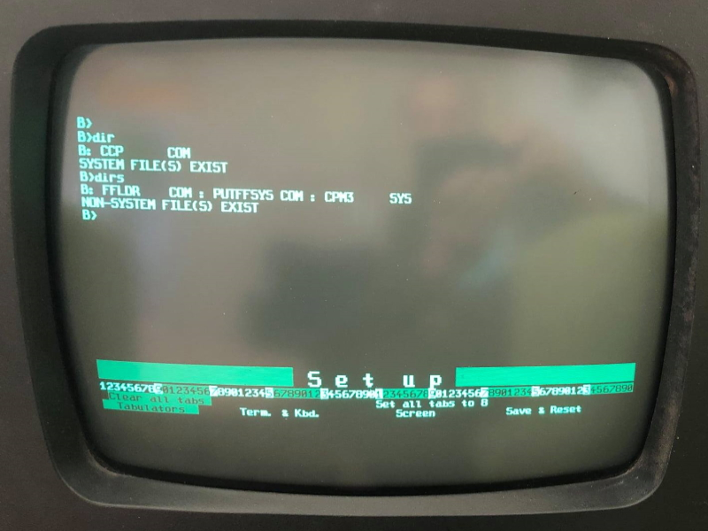
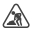

![status.badge] [![language.badge]][language.url] [![standard.badge]][standard.url] [![license.badge]][license.url]

# idp-dev

Welcome to the **idp-dev**, a repository, dedicated to the 
Iskra Delta Partner development.

 

We are a group of volunteers, providing tools and tutorials to developers
writing software for the Iskra Delta Partner computer.

> The repository is currently under construction. Things change. 

# Table of Contents

- [Projects](#projects)
  * [The C Runtime](#the-c-runtime)
    + [Startup Code](#startup-code)
    + [SDCC Auxiliary Library](#sdcc-auxiliary-library)
    + [Standard C Library](#standard-c-library)
      - [Tests](#tests)
    + [Hello Partner Project](#hello-partner-project)
  * [GPX](#gpx)
  * [xyz](#xyz)
  * [TETRIS](#tetris)
- [Building](#building)
  * [On Linux](#on-linux)
- [Internals](#internals)
- [Creating disks](#creating-disks)
  * [Create hard drive](#create-hard-drive)
  * [Create floppy drive](#create-floppy-drive)
  * [Add local files to disk](#add-local-files-to-disk)
  * [Remove files from disk](#remove-files-from-disk)
- [The Emulator](#the-emulator)
- [Thank you](#thank-you)

# Projects

## The C Runtime

The goal of this project is to create a C11 compiler and a standard C library 
for the Iskra Delta Partner. We are adjusting the SDCC compiler suite to
generate (.COM) files for Iskra Delta Partner. 

It consists of three main modules:

| Module                     | Status (complete) |
|----------------------------|-------------------|
| The startup code           | |
| The SDCC auxiliary library | |
| The Standard C library     | |  

To compile your source code, you must strip it of all SDCC defaults, and
use Partner defaults instead. Following switches should be used.

 * `--no-std-crt0`. This switch tells the compiler not to include the SDCC
   C startup file `crt0.s`. You replace it by adding the `scripts/crt0cpm.s`
   as the first file to your project.
 * `--nostdinc`. This will prevent the SDCC to include standard headers from
   the SDCC standard library. You can use the `-I` to redirect to Partner's
   standard library headers `-I /include/clib` instead.
 * `--nostdlib`. This will tell the SDCC linker no to link the SDCC standard
   library. You can replace it by instructing the linker to search the `build/`
   folder for `libsdcc`, and `libccpm`, like this `-Lbuild -llibsdcc -llibcpm`  

Consult the `hello` chapter for complete command line to use to compile your
C source code to Iskra Delta Partner binary.

### Startup Code

The startup code is file `scripts/crt0cpm.s`. This code should compile 
to the `0x100` address. It initializes the stack and the heap, reads and
stores the command line arguments (if any!), calls your `main()` function 
and, after it completes, calls the CP/M (BDOS) `exit()`. 

### SDCC Auxiliary Library

The `libsdcc` auxiliary library is located in the `lib/sdcc/` folder.

This library is the glue betweeen the SDCC C compiler and the
Z80 processor. Z80 lacks instructions for integer multiplication 
and division, and for handling long integers and floating point 
numbers.

To mitigate it, the SDCC C compiler replaces these non-existing
instructions with calls to special functions (such as: `__mulint`).
Invisible to you, the linker then links these special functions 
with your code.

This works in the SDCC realm, but if you prevent the compiler to link
default SDCC libraries (by using directives `--nostdlib`, `--nostdinc`, 
and `--no-std-crt0`) then you need to provide these special functions,
and the `libsdcc` does that.

### Standard C Library

#### Tests

The `test/stdlib` folder contains tests for the library, using the tiny
[test framework of Eric Radman](https://eradman.com/posts/tdd-in-c.html),
based on [the original MinUnit by John Brewer](http://www.jera.com/techinfo/jtns/jtn002.html).

### Hello Partner Project

The Iskra Delta Partner Hello World program is located in the `src/hello` folder.

~~~cpp
#include <stdio.h>

int main(int argc, char * argv[]) {
    printf("Hello world!\n");
    return 0;
}
~~~

and does what every **Hello World** program in the world should do. 

## GPX

The goal of this project is to create fast graphical library for Iskra Delta
Partner.

## xyz

The goal of this project is to create a graphical, multitasking operating system
to replace the CP/M on Iskra Delta Partner.

## TETRIS

Porting terminal version of the game of Tetris.

# Building

## On Linux

Make sure you have gcc, sdcc, and cpmtools installed.

Compile with 

`make`

Create disk image for the emulator with

`make install`

All output will go to the build folder. Disk image that you 
can import into Partner emulator (using Alt+O) is called `fddb.img`.

# Internals

While reverse engineering the Partner and writing code, we keep notes 
on its internal functioning. While these are not well structured,
they are a rich source of information about inner functioning of
Iskra Delta Partner and the softwares.

 * [Computer and OS start up process](doc/notes/startup-notes.md)
 * [Text (&terminal)](doc/notes/avdc-notes.md)
 * [Graphics](doc/notes/gdp-notes.md)
 * [Hard disk](doc/notes/hdd-notes.md)
 * [Floppy disk](doc/notes/fdd-notes.md)
 * [Serial communication (Z80 SIO)](doc/notes/z80sio-notes.md)
 * [Real time clock](doc/notes/rtclock-notes.md)
 * [Porting software plans](doc/notes/porting-notes.md)

# Creating disks

Use cpmtools to create your own disks for the emulator.

http://www.moria.de/~michael/cpmtools/

Disk definitions for Partner floppy and hard drives are in
the the `scripts\diskdefs` file.
 * idpfdd for floppy drive
 * idphdd for the hard disk

## Create hard drive

*Note: -f is disk format and can be idphdd or idpfdd.*

`mkfs.cpm.exe -f idphdd -t hdda.img`

## Create floppy drive

`mkfs.cpm.exe -f idpfdd -t fddb.img`

## Add local files to disk

*Following command adds file test.com to area 0: of floppy drive fddb.img.*

`cpmcp -f idpfdd fddb.img test.com 0:test.com`

## Remove files from disk

`cpmrm -f idpfdd fddb.img 0:test.com`

# The Emulator

You can download the emulator from here.

http://matejhorvat.si/sl/slorac/delta/partner/index.htm

Once you are in the emulator, press Alt+O and select the `fddb.img` file. This will create `B:` drive. Finally, type...

~~~
B:
DIR
HELLO
~~~

And, voila...

# Thank you

**Miha Grcar** for keeping a Partner Revival Slack, testing, and sharing his findings.

**Matej Horvat** for sharing technical details about his emulator and code samples.

**Tomaz Stih**, 22.05.2021

[language.url]:   https://en.wikipedia.org/wiki/ANSI_C
[language.badge]: https://img.shields.io/badge/language-C-blue.svg

[standard.url]:   https://en.wikipedia.org/wiki/C89/
[standard.badge]: https://img.shields.io/badge/standard-C89-blue.svg

[license.url]:    https://github.com/tstih/nice/blob/master/LICENSE
[license.badge]:  https://img.shields.io/badge/license-MIT-blue.svg

[status.badge]:  https://img.shields.io/badge/status-unstable-red.svg