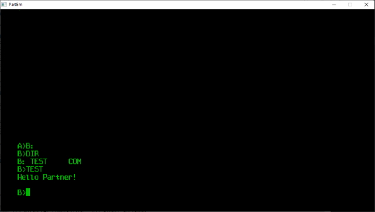

# idp

 > This repository is undergoing reconstruction. Please visit in a week.

Welcome to the Iskra Delta Partner development repository. Here you'll find the tools and manuals for Iskra Delta Partner development. 

What are you after?

Just looking for cool Iskra Delta Partner Software
I want to develop for the original Iskra Delta Partner (CP/M)
I want to development for the yos/zwin OS for Iskra Delta Partner

# Software

## Games

| file         | description                                               |
|--------------|-----------------------------------------------------------|
| KONTRA.COM   | Kontrabant is a port of known Slovenian ZX Spectrum game. |
| AIDS.COM     | The Asteroids game.                                       |
| TETRIS.COM   | The game of Tetris.                                       |
| BREAKOUT.COM | Break out game.                                           |
| PONG.COM     | A port of Atari Pong game.                                |

## Utilities

| file         | description                                               |
|--------------|-----------------------------------------------------------|
| KONTRA.COM   | Kontrabant is a port of known Slovenian ZX Spectrum game. |

# Building code samples 

## On Windows

Sorry, only Linux is supported at this time.

## On Linux

Make sure you have gcc, sdcc, and cpmtools installed.

Compile with 

`make`

Create disk image for the emulator with

`make install`

All output will go to the build folder. Disk image that you 
can import into Partner emulator (using Alt+O) is called `fddb.img`.

# Creating disks

Use cpmtools to create your own disks for the emulator.

http://www.moria.de/~michael/cpmtools/

Disk definitions for Partner floppy and hard drives are in
the the `scripts\diskdefs` file.
 * idpfdd for floppy drive
 * idphdd for the hard disk

## Create hard drive

*Note: -f is disk format and can be idphdd or idpfdd.*

`mkfs.cpm.exe -f idphdd -t hdda.img`

## Create floppy drive

`mkfs.cpm.exe -f idpfdd -t fddb.img`

## Add local files to disk

*Following command adds file test.com to area 0: of floppy drive fddb.img.*

`cpmcp -f idpfdd fddb.img test.com 0:test.com`

## Remove files from disk

`cpmrm -f idpfdd fddb.img 0:test.com`

 # Iskra Delta Partner emulator

 You can find the emulator here.

 http://matejhorvat.si/sl/slorac/delta/partner/index.htm

 Once you are in the emulator, press Alt+O and select the `build\fddb.img` file.
 This will create `B:` drive. Finally, type...

 ~~~
 B:
 DIR
 HELLO
 ~~~

 And, voila...

 

# Links

http://cpmarchives.classiccmp.org/

 # Thank you

 Matej Horvat for kindly sharing technical details about his emulator and functioning of a Partner, and complex code samples.

 Miha Grcar for keeping a Partner Revival Slack and sharing his findings there.

Cheers,
Tomaz Stih