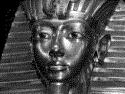
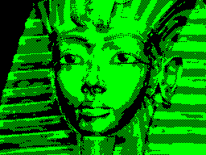
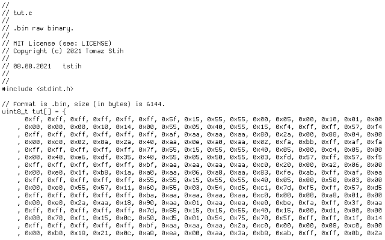

![status.badge] [![language.badge]][language.url] [![standard.badge]][standard.url] [![license.badge]][license.url]
 
# gpxtools

Tools for **preparing glyphs** (bitmaps, sprites, mouse cursors, and fonts) for 
the *Iskra Delta Partner*. *Partner's* vector display demands special file formats
because drawing classic rasters pixel by pixel is too slow for normal operation.

*gpxtools* introduces a plethora of approaches: from simple vectorization, 
to vector friendly dithering. All tools operate on most PC image formats and
convert them into 

# Using the tools

All tools are written in *.NET Core* and should compile on every platform that
supports `System.Drawing`. Standard command line for each tool is 

`<tool> <command> <arguments>` 

There are three tools:

| Tool       | Descfiption                                                    |
|------------|----------------------------------------------------------------|
| part       | Convert images to *Partner* format and/or export to `C`,`ASM`. |
| sil        | Converts silhouete images into outlines (lines).               |
| snatch     | Snatch array from image (fonts from full ascii bitmans)        |

Each tool has many commands, and each command many switches. If you run
the tool without the command it will print available commands.

# The Partnerize

Partnerize tool converts images to Partner format and exports them in
`PNG`, `C`, and `S` (*SDCC* assembly) formats. 

## Dither command

The `dither` commands accepts an image, dithers it, and exports is as
`BIN`, `PNG`, and `S` file. 

The commend accepts two arguments: 
 * `-o` or `-save` is the output filename without extension
 * `-f` or `-file` is the input image filename

Example:

`part dither -f tut.jpg -o tut`

## Three command

The `three` command accepts an image, optionally resizes it, reduces
number of colors to three, converts it to grayscale, and then replaces
bright color with green, dark color with black, and mid color with
*Partners'* dotted line. The key feature of this command is that only three
line pattersn are used to draw it: solid black, solid green, and dotted.

The commend accepts following arguments: 
 * `-o` or `-save` is the output filename without extension
 * `-f` or `-file` is the input image filename
 * (optional) `-w` or `-width` is max. allowed width
 * (optional) `-h` or `-height` is max. allowed height
 * (optional) `-d` or `-dark` detects edges and draws them with dark (black) line
 * (optional) `-l` or `-light` detects edges and draws them with light (green) line

The command creates `BIN`, `S`, and `PNG` files

`part three -f tut.jpg -o tut`

## cbin command

Converts any raw binary file to `C` source code.

The commend accepts following arguments: 
 * `-o` or `-save` is the output filename without extension
 * `-f` or `-file` is the input image filename
 * (optional) `-a` or `-author` is name of author in format 
   `short name, first name, last name`
 
'part cbin -f tut.bin -o tut -a tstih,Tomaz,Stih`

## bgra command

Converts image to raw *BGRA* format and saves it as *C++* source file. 

The command accepts following arguments:
 * `-o` or `-save` is the output filename without extension
 * `-f` or `-file` is the input image filename

`part bgra -f tut.png -o tut`

 > This special command does not prepare file for the *Iskra Delta Partner*,
 > the *BGRA* format is embedded image format for the **idp-emu** emulator.

# The Silhouette

...to be continued...

## animate command

...to be continued...

# The Snatch

...to be continued...

## array command

...to be continued...

[language.url]:   https://docs.microsoft.com/en-us/dotnet/csharp/
[language.badge]: https://img.shields.io/badge/language-CSharp-blue.svg

[standard.url]:   https://en.wikipedia.org/wiki/.NET
[standard.badge]: https://img.shields.io/badge/standard-.NETCore-blue.svg

[license.url]:    https://github.com/tstih/nice/blob/master/LICENSE
[license.badge]:  https://img.shields.io/badge/license-MIT-blue.svg

[status.badge]:  https://img.shields.io/badge/status-alpha-red.svg