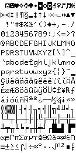
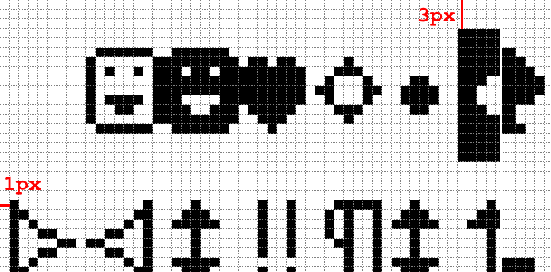
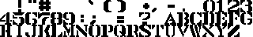
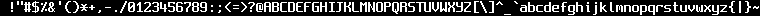
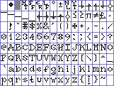

![status.badge] [![language.badge]][language.url] [![standard.badge]][standard.url] [![license.badge]][license.url]
 
# gpxtools

Tools for **preparing glyphs** (bitmaps, sprites, mouse cursors, and fonts) for 
the *Iskra Delta Partner*. *Partner's* vector display demands special file formats
because drawing classic rasters pixel by pixel is too slow for normal operation.

*gpxtools* introduces a plethora of approaches: from simple vectorization, 
to vector friendly dithering. All tools operate on most PC image formats and
convert them into 

# Using the tools

All tools are written in *.NET Core* and should compile on every platform that
supports `System.Drawing`. Standard command line for each tool is 

`<tool> <command> <arguments>` 

There are three tools:

| Tool       | Descfiption                                                    |
|------------|----------------------------------------------------------------|
| part       | Convert images to *Partner* format and/or export to `C`,`ASM`. |
| sil        | Converts silhouete images into outlines (lines).               |
| snatch     | Snatch array from image (fonts from full ascii bitmans)        |

Each tool has many commands, and each command many switches. If you run
the tool without the command it will print available commands.

# The Partnerize

Partnerize tool converts images to Partner format and exports them in
`PNG`, `C`, and `S` (*SDCC* assembly) formats. 

## Dither command

The `dither` commands accepts an image, dithers it, and exports is as
`BIN`, `PNG`, and `S` file. 

The commend accepts arguments: 
 * `-o` or `-save` is the output filename without extension
 * `-f` or `-file` is the input image filename
 * `-w` or `-width` is the desired width
 * `-h` or `-height` is the desired height

Image will never be upscaled, but it will be downscaled if too
big to fit `-w` and `-h`. The proportions will be maintained.

Example:

`part dither -f tut.jpg -o tut`

## Three command

The `three` command accepts an image, optionally resizes it, reduces
number of colors to three, converts it to grayscale, and then replaces
bright color with green, dark color with black, and mid color with
*Partners'* dotted line. The key feature of this command is that only three
line pattersn are used to draw it: solid black, solid green, and dotted.

The commend accepts following arguments: 
 * `-o` or `-save` is the output filename without extension
 * `-f` or `-file` is the input image filename
 * (optional) `-w` or `-width` is max. allowed width
 * (optional) `-h` or `-height` is max. allowed height
 * (optional) `-d` or `-dark` detects edges and draws them with dark (black) line
 * (optional) `-l` or `-light` detects edges and draws them with light (green) line

The command creates `BIN`, `S`, and `PNG` files

`part three -f tut.jpg -o tut`

## cbin command

Converts any raw binary file to `C` source code.

The commend accepts following arguments: 
 * `-o` or `-save` is the output filename without extension
 * `-f` or `-file` is the input image filename
 * (optional) `-a` or `-author` is name of author in format 
   `short name, first name, last name`
 
'part cbin -f tut.bin -o tut -a tstih,Tomaz,Stih`

## bgra command

Converts image to raw *BGRA* format and saves it as *C++* source file. 

The command accepts following arguments:
 * `-o` or `-save` is the output filename without extension
 * `-f` or `-file` is the input image filename

`part bgra -f tut.png -o tut`

 > This special command does not prepare file for the *Iskra Delta Partner*,
 > the *BGRA* format is embedded image format for the **idp-emu** emulator.

# The Silhouette

The Silhouette extract ab animation from animated gif and converts it 
to multiple glyphs. Glyphs are converted into the `line` format and
can be filled i.e. **scanlines** or drawn i.e. **outline**.

For good results the image must be a silhouette.

## animate command

...to be continued...

# The Snatch

*Snatch* is used to extract an array of glyphs from the image and convert them
to *Parther* graphics. To extract an array from image, you need to tell it where
images are, how they are organized, what color they are etc. This makes
*snatch* the most complex of all the tools.

Your input will typically be like this...

As other tools, snatch accepts command and parameters. At present, snatch only
has one command: `array`.

## array command

Array command accepts standard arguments:
 * `-o` or `-save` is the output filename without extension
 * `-f` or `-file` is the input image filename

### Snatch margins and padding

You can set margins in pixels with parameters `l`, `r`, `t`, and `b` followed 
by a number of pixels  for left, right, top, and bottom margin. Our margins for
the font above are 1px horizontal and 3px vertical, on both sides.

So our import starts with...

snatch -left 1 -right 1 -top 3 -bottom 3

You can also set horizontal and vertical padding between two characters using 
`hp` for horizontal padding and `vp` for vertical padding. In our case there is
no padding, so we'll set `hp` and `vp` to zero.

snatch -l 1 -r 1 -t 3 -b 3 -hp 0 -v0 0

 > Zero is the default value for margins and both paddings if not provided by you. 

### Ascii range

Sometimes a font is limited to certain ascii range. With switches `start` and `end`
you can tell *snatch* which is the first and which the last glyph. 

Following limited font only contains 60 characters, starting with ascii 32, 
and ending with 91.

Your command line for this font would include switches `-s 32` `-e 91`.

### Glyph dimensions

You can set glyph width and height in pixels with switches `gw` and `gh'. *Snatch*
expects every glyph on the source image to have the same width and height. 

But when exporting, you can tell *snatch* to detect glyph width and convert 
a fixed font into a proportional font.

 > The height doesn't change when converting font to proportional.

If converting to proportional font, the system detects width of a font by measuring
space between min. and max. horizontal pixel of a character. But it can't know what 
the width should be if a character is an empty glyph - for example a space.

For this you can use switch `ew` (empty width) which will set the width of all 
empty glyphs to this value. 

### Colors

To extract a font from an image, you can set the glyph pixel color, the transparent 
(*background*) color, and the mask with switches `c` for point color, `mc` for mask 
color, and `tc` for transparent color.

You can set a treshold for pixel color with a `th` switch (from 0 to 255) to tell 
*snatch* to recognize colors near your pixel color as pixels.

For above case you'd use the `-c #ffffff` (pixel color is white), and reasonable
threshold `-th 32`.

 > Color can be provided as hex value or as comma separater RGB, without
 > spaces i.e. `-c 128,0,0` for red.

### Export format 

You can tell snatch the format of the result (output) file should be with
the `-fmt` or `-format` switch which accepts values:
 * `grid` ... draw a grid on the image, this is used to test if your grid
               fits the source image.
 * `c` ... generate C source code
 * `asm` ... generate ASM source code
 * `glyphs` ... generate one (separate) image for each extracted glyph

### Example

Here is an image of a non-trivial font - the dagger. 

The source file is called `dagger.gif`, and we want to produce
`dagger-grid.png`, so we'll use `-f dagger.gif`, `-format grid`,
and `-o dagger-grid` (`.png` is default format for grid exports).

We will extract first 128 ascii characters hence we'll need the
parameters `-s 0` and `-e 127`. The image has left and top margins,
both equal to 3, so let's add `-l 3` and `-t 3`.

Finally, because there are several colors in the image and the default
pixel color is black, we'll use threshold 128 to exclude white and blue
areas.

Here is the final command...

~~~
snatch array -f dagger.gif -o dagger -format grid \ 
    -l 3 -t 3 -gw 9 -gh 14 \
    -start 0 -end 127 \
    -th 128
~~~

With the grid above you can check that all parameters for export are
correct and every character fits into its cell. Now is the time to
produce a proportional raster font.

We'll change the export format to assembler with `-format asm`,
add `-proportional` or `-p`, and set the empty glyph width to
6 with `-ew 6`.

~~~
snatch array -f dagger.gif -o dagger -format asm \ 
    -l 3 -t 3 -gw 9 -gh 14 \
    -start 0 -end 127 \
    -th 128 \
    -proportional -ew 6
~~~

After running this, your dagger.s is ready to be compiled with your
code.

[language.url]:   https://docs.microsoft.com/en-us/dotnet/csharp/
[language.badge]: https://img.shields.io/badge/language-CSharp-blue.svg

[standard.url]:   https://en.wikipedia.org/wiki/.NET
[standard.badge]: https://img.shields.io/badge/standard-.NETCore-blue.svg

[license.url]:    https://github.com/tstih/nice/blob/master/LICENSE
[license.badge]:  https://img.shields.io/badge/license-MIT-blue.svg

[status.badge]:  https://img.shields.io/badge/status-alpha-red.svg